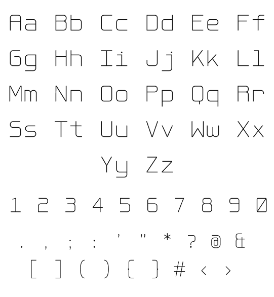
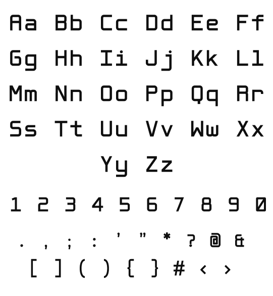

# Outpost Mono

A futuristic [monospace font](https://en.wikipedia.org/wiki/Monospaced_font) designed for the terminals of martian outposts, but ready for earth's terminals and editors today.

Outpost Mono is available in three weights: light, regular, and bold.

|  |  |  |
| -------------------------- | -------------------------- | -------------------------- |

[Download the latest font files](https://github.com/ursooperduper/outpost-mono/releases/download/v1.0/outpost-mono-all-fonts-v1.0.zip)

#### Language Support

Outpost Mono offers support for Latin, Cyrillic, and basic Greek languages.

#### License

Outpost Mono is open source and available under a standard [SIL Open Font License](https://openfontlicense.org) 1.1. 

Outpost Mono is a Reserved Font Name by Studio Sooper ([font vendor code: SOOP](https://learn.microsoft.com/en-us/typography/vendors/#s))

You are free to use, copy, and make change to this font, but please read **[the license, OFL.txt](OFL.txt)** to understand appliable restrictions.

#### Feedback? Errors? Suggestions? 

If you have feedback, notice a bug, or want to suggest additional characters or other ideas, [please create an Issue](https://github.com/ursooperduper/outpost-mono/issues).

